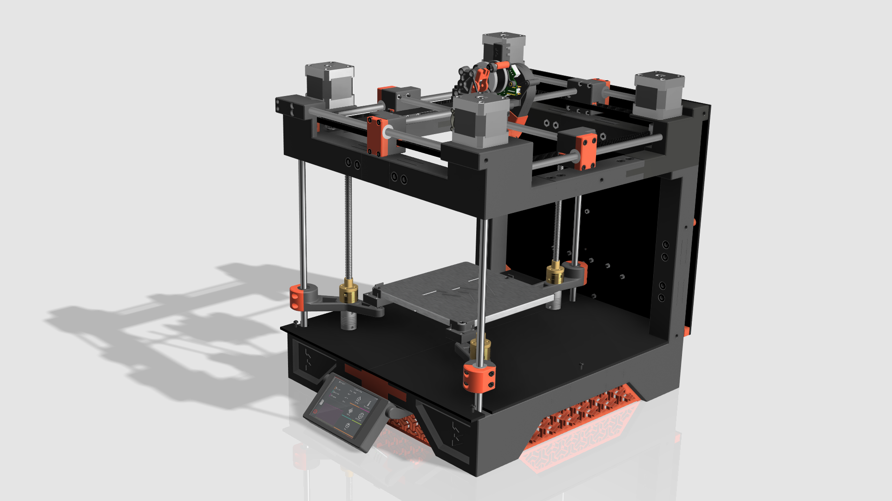

# Bikin 15

Bikin 15 is a cross-gantry, direct drive fdm printer, framed entirely by printed parts. It is capable of replicating itself, and its soon to be designed larger siblings. Kinematics is using a cross-gantry, quad drive cartesian on linear rods. On a base build, with generic unbranded parts, bom is $300ish. With addons, example enclosure, cost should be abt $400. Despite its low cost of entry, its loaded with advance features, mostly only seen in advance printers.



# Features

* 150x150x150 build size
* Multiple choices for direct drive extruder/hotend
* Cross-gantry kinematics provides cleaner prints at faster speed
* Frame parts printable on a 150x150 bed
* Fully encloseable
* Low cost of build
* Triple z with auto leveling
* Clean toolhead design utilizing can bus
* Driven by Klipper with Klipperscreen

# Thanks

## Inspiration

Parts of Bikin 15 are inspired by these:

* Other printed frame printers: Babycube, Rook, The100
* Other cross gantry printers: Annex K1/K2/K3, CroXY, Hypercube Overkill
* Other triple z printers

## Admiration for Advance Printers

These printers/developers are our idols. They set the benchmark for us. We thank them, and their strong community for the development of advance printers we see today.

* Voron
* Hevort
* VzBot
* Annex K series
* Ratrig

### Gallery

```
[../images/Screenshot_2023-11-05_210552.jpg](../images/Screenshot_2023-11-05_210552.jpg)
[../images/Bikin15_Beta.jpg](../images/Bikin15_Beta.jpg)
[../images/Bikin15_Beta_1.jpg](../images/Bikin15_Beta_1.jpg)
[../images/Bikin15_Beta_2.jpg](../images/Bikin15_Beta_2.jpg)
[../images/Bikin15_Beta_3.jpg](../images/Bikin15_Beta_3.jpg)
[../images/Bikin15_Beta_v27.jpg](../images/Bikin15_Beta_v27.jpg)
```
